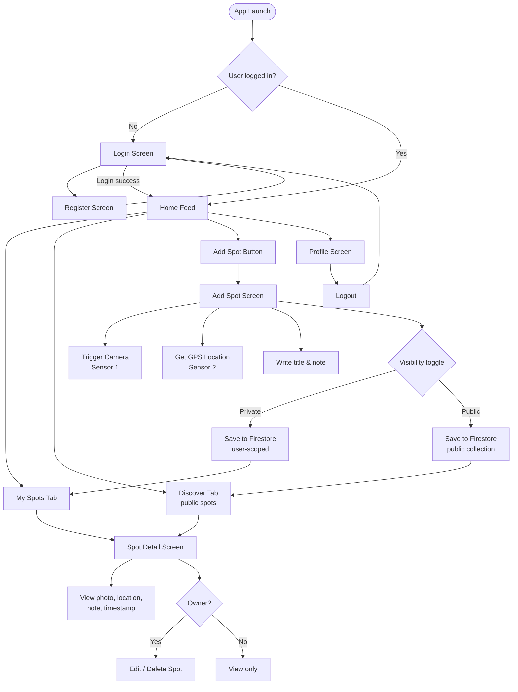

# SpotSave – Planung & Lösungskonzept
**Modul 335 Projekt**  
**Autor:** Filip Jovic
**Datum:** 2026-05-10

---

## Inhaltsverzeichnis
1. [App-Idee & Anforderungen](#1-app-idee--anforderungen)
2. [Screen-Storyboard](#2-screen-storyboard)
3. [Funktionale Anforderungen](#3-funktionale-anforderungen)
4. [Technische Anforderungen](#4-technische-anforderungen)
5. [Testplan](#5-testplan)
6. [Lösungskonzept](#6-lösungskonzept)

---

## 1. App-Idee & Anforderungen

**SpotSave** ist eine mobile Utility-App, mit der Benutzer bedeutungsvolle Orte mit einem Foto und einer kurzen Notiz speichern können. Jeder gespeicherte Ort kann privat bleiben oder öffentlich geteilt werden, sodass andere Benutzer ihn entdecken können. Die App funktioniert wie ein persönliches geo-getaggtes Fototagebuch mit einem optionalen öffentlichen Discovery-Feed.

### Anwendungsfälle
- Ein Wanderer speichert einen schönen Aussichtspunkt mit Foto und Notiz zur späteren Referenz
- Ein Reisender dokumentiert Restaurants, Geschäfte oder Sehenswürdigkeiten, die er sich merken möchte
- Ein Benutzer durchstöbert öffentlich geteilte Spots anderer Benutzer in seiner Umgebung

---

## 2. Screen-Storyboard

Das folgende Diagramm zeigt den vollständigen Screen-Flow der App:

---

## 3. Funktionale Anforderungen

| # | Funktion | Beschreibung |
|---|---------|-------------|
| F01 | Benutzerregistrierung | Neue Benutzer können ein Konto mit E-Mail & Passwort erstellen |
| F02 | Benutzer-Login | Bestehende Benutzer können sich mit E-Mail & Passwort anmelden |
| F03 | Logout | Benutzer können sich über den Profilscreen abmelden |
| F04 | Foto aufnehmen | Die Kamera öffnet sich, um ein Foto für einen neuen Spot aufzunehmen |
| F05 | Standort ermitteln | GPS-Koordinaten werden beim Hinzufügen eines Spots automatisch erfasst |
| F06 | Spot hinzufügen | Benutzer können einen Spot mit Foto, GPS, Titel, Notiz und Sichtbarkeitseinstellung speichern |
| F07 | Meine Spots | Benutzer sehen eine Liste aller ihrer eigenen gespeicherten Spots |
| F08 | Discovery-Feed | Benutzer sehen alle öffentlich geteilten Spots aller Benutzer |
| F09 | Spot-Detail | Ein Tippen auf einen Spot zeigt die vollständige Detailansicht (Foto, Notiz, Standort, Zeitstempel) |
| F10 | Spot bearbeiten | Eigentümer können Titel, Notiz oder Sichtbarkeit ihrer eigenen Spots bearbeiten |
| F11 | Spot löschen | Eigentümer können ihre eigenen Spots löschen |
| F12 | Privat/Öffentlich-Umschalter | Beim Hinzufügen eines Spots kann der Benutzer die Sichtbarkeit festlegen |

---

## 4. Technische Anforderungen

| Anforderung | Umsetzung |
|-------------|---------------|
| Sensor 1 – Kamera | `expo-camera` / `expo-image-picker` |
| Sensor 2 – GPS | `expo-location` |
| Persistente Speicherung | Firebase Firestore |
| Authentifizierung | Firebase Authentication (E-Mail/Passwort) |
| Framework | React Native mit Expo |
| App-Typ | Hybrid App (plattformübergreifend via Expo) |
| Navigation | `expo-router` / `react-navigation` |
| Bildspeicherung | Firebase Storage |
| Deployment | EAS Build → `.apk` |

---

## 5. Testplan

### Testfälle

| TC# | Testfall | Vorbedingung | Schritte | Erwartetes Ergebnis |
|-----|-----------|--------------|-------|-----------------|
| TC01 | Neuen Benutzer registrieren | App geöffnet, kein Konto vorhanden | 1. App öffnen → Registrieren → E-Mail & Passwort eingeben → Absenden | Konto erstellt, Benutzer wird zum Home weitergeleitet |
| TC02 | Login mit gültigen Zugangsdaten | Konto vorhanden | 1. App öffnen → Login → Korrekte Zugangsdaten eingeben → Absenden | Benutzer eingeloggt, Home-Screen wird angezeigt |
| TC03 | Login mit ungültigen Zugangsdaten | Konto vorhanden | 1. App öffnen → Login → Falsches Passwort eingeben → Absenden | Fehlermeldung wird angezeigt, Benutzer bleibt auf dem Login-Screen |
| TC04 | Privaten Spot hinzufügen | Eingeloggt | 1. Add tippen → Foto aufnehmen → Standort erlauben → Titel & Notiz eingeben → Privat setzen → Speichern | Spot erscheint in „Meine Spots", nicht im Discover-Feed |
| TC05 | Öffentlichen Spot hinzufügen | Eingeloggt | 1. Add tippen → Foto aufnehmen → Standort erlauben → Titel & Notiz eingeben → Öffentlich setzen → Speichern | Spot erscheint in „Meine Spots" und im Discover-Feed |
| TC06 | Kamera-Berechtigung verweigert | Eingeloggt | 1. Add tippen → Kamera-Berechtigung verweigern | Fehlermeldung erscheint, Benutzer wird aufgefordert, die Kamera in den Einstellungen zu erlauben |
| TC07 | GPS-Berechtigung verweigert | Eingeloggt | 1. Add tippen → Standort-Berechtigung verweigern | Fehlermeldung erscheint, Benutzer wird aufgefordert, den Standort in den Einstellungen zu erlauben |
| TC08 | Spot-Detail anzeigen | Spots vorhanden | 1. Beliebigen Spot in der Liste antippen | Detailscreen zeigt Foto, Notiz, Standort, Zeitstempel |
| TC09 | Eigenen Spot bearbeiten | Eigener Spot vorhanden | 1. Eigenen Spot öffnen → Bearbeiten tippen → Notiz ändern → Speichern | Aktualisierte Notiz wird in der Detailansicht angezeigt |
| TC10 | Eigenen Spot löschen | Eigener Spot vorhanden | 1. Eigenen Spot öffnen → Löschen tippen → Bestätigen | Spot wird aus der Liste und aus Firestore entfernt |
| TC11 | Fremden Spot nicht bearbeiten können | Öffentlicher Spot eines anderen Benutzers sichtbar | 1. Spot eines anderen Benutzers öffnen | Keine Bearbeiten- oder Löschen-Option sichtbar |
| TC12 | Logout | Eingeloggt | 1. Profil öffnen → Logout tippen | Benutzer wird zum Login-Screen weitergeleitet, Session wird gelöscht |
| TC13 | Firestore-Persistenz | Spot gespeichert | 1. App schliessen und erneut öffnen | Zuvor gespeicherte Spots werden weiterhin angezeigt |
| TC14 | Discover-Feed lädt öffentliche Spots | Mindestens 1 öffentlicher Spot vorhanden | 1. Discover-Tab öffnen | Öffentliche Spots aller Benutzer werden angezeigt |

---

## 6. Lösungskonzept

### 6a. Framework & App-Typ

SpotSave wird als **Hybrid App** mit **React Native und Expo** entwickelt. Dies ermöglicht eine einzige Codebasis für Android und iOS, während Expo vorgefertigte native Module für Kamera- und GPS-Zugriff bereitstellt, ohne nativen Code konfigurieren zu müssen.

**Entwicklungsumgebung:** VS Code mit Expo Go für Live-Tests auf dem Gerät, EAS Build für die finale `.apk`-Paketierung.

**Wichtigste Komponenten:**
- `expo-camera` / `expo-image-picker` — Kamerazugriff
- `expo-location` — GPS-Koordinaten
- `firebase/firestore` — Cloud-Datenbank
- `firebase/auth` — Benutzerauthentifizierung
- `firebase/storage` — Foto-Upload & Hosting
- `expo-router` — dateibasierte Navigation

### 6b. Sensoren, Speicherung & Authentifizierung

**Kamera (Sensor 1)**  
Wenn ein Benutzer auf „Spot hinzufügen" tippt, fordert die App über `expo-image-picker` eine Kamera-Berechtigung an. Das aufgenommene Bild wird in Firebase Storage hochgeladen, und die zurückgegebene URL wird zusammen mit dem Spot-Dokument in Firestore gespeichert.

**GPS (Sensor 2)**  
Auf dem „Spot hinzufügen"-Screen fordert `expo-location` eine Vordergrund-Standortberechtigung an und ruft die aktuellen Koordinaten (`latitude`, `longitude`) ab. Diese werden im Firestore-Spot-Dokument gespeichert und können später zur Anzeige des Spots auf einer Karte verwendet werden.

**Firebase Firestore (Persistente Speicherung)**  
Spots werden in zwei Firestore-Collections gespeichert:
- `users/{uid}/spots` — private Spots, nur für den Eigentümer zugänglich
- `spots` (öffentliche Collection) — öffentlich geteilte Spots, lesbar für alle authentifizierten Benutzer

Jedes Dokument enthält: `title`, `note`, `imageUrl`, `location` (lat/lng), `timestamp`, `uid`, `visibility`.

**Firebase Authentication**  
Die E-Mail/Passwort-Authentifizierung wird über Firebase Auth abgewickelt. Nach dem Login/Registrieren erhält der Benutzer ein Session-Token, das vom Firebase SDK verwaltet wird. Firestore Security Rules verwenden `request.auth.uid`, um sicherzustellen, dass Benutzer nur ihre eigenen Spots schreiben und löschen können.

---

*Dokumentsprache: Deutsch | English version: [planning.md](planning.md)*
