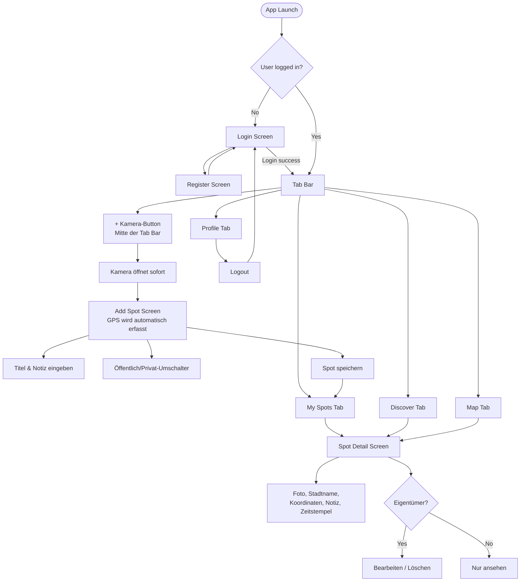

# SpotSave – Planung & Lösungskonzept
**Modul 335 – Kompetenznachweis**
**Autor:** Filip Jovic
**Datum:** 2026-05-10 (überarbeitet 2026-06-22)

---

## Inhaltsverzeichnis
1. [App-Idee & Anforderungen](#1-app-idee--anforderungen)
2. [Screen-Storyboard](#2-screen-storyboard)
3. [Funktionale Anforderungen](#3-funktionale-anforderungen)
4. [Technische Anforderungen](#4-technische-anforderungen)
5. [Testplan](#5-testplan)
6. [Lösungskonzept](#6-lösungskonzept)

---

## 1. App-Idee & Anforderungen

**SpotSave** ist eine mobile Utility-App, mit der Benutzer bedeutungsvolle Orte mit einem Foto und einer kurzen Notiz speichern können. Jeder gespeicherte Ort wird über das GPS des Geräts geo-getaggt und auf einer interaktiven Karte angezeigt. Spots können privat bleiben oder optional öffentlich geteilt werden, sodass andere Benutzer sie entdecken können. Die App funktioniert wie ein persönliches geo-getaggtes Fototagebuch mit einem optionalen öffentlichen Discovery-Feed.

### Anwendungsfälle
- Ein Wanderer speichert einen schönen Aussichtspunkt mit Foto und Notiz zur späteren Referenz
- Ein Reisender dokumentiert Restaurants, Geschäfte oder Sehenswürdigkeiten, die er sich merken möchte
- Ein Benutzer durchstöbert öffentlich geteilte Spots anderer Benutzer im Discover-Feed
- Ein Benutzer sieht alle seine gespeicherten Spots auf einer Karte

---

## 2. Screen-Storyboard

Das folgende Diagramm zeigt den vollständigen Screen-Flow der App:

---

## 3. Funktionale Anforderungen

| # | Funktion | Beschreibung |
|---|---------|-------------|
| F01 | Benutzerregistrierung | Neue Benutzer können ein Konto mit E-Mail & Passwort erstellen |
| F02 | Benutzer-Login | Bestehende Benutzer können sich mit E-Mail & Passwort anmelden |
| F03 | Logout | Benutzer können sich über den Profilscreen abmelden |
| F04 | Foto aufnehmen | Tippen auf den mittleren Kamera-Button öffnet die Kamera sofort |
| F05 | Aus Bibliothek wählen | Sekundäre Option auf My Spots, um ein vorhandenes Foto auszuwählen |
| F06 | Automatische GPS-Erfassung | GPS-Koordinaten werden beim Öffnen des Add-Spot-Screens automatisch erfasst |
| F07 | Spot hinzufügen | Benutzer können einen Spot mit Foto, GPS, Titel, Notiz und Sichtbarkeitseinstellung speichern |
| F08 | Meine Spots | Benutzer sehen eine Liste aller eigenen Spots mit Stadtname und Foto |
| F09 | Discovery-Feed | Benutzer sehen öffentlich geteilte Spots aller Benutzer |
| F10 | Kartenansicht | Alle Spots des Benutzers werden als Pins auf einer interaktiven Karte angezeigt |
| F11 | Spot-Detail | Tippen auf einen Spot zeigt: Foto, Stadtname, Koordinaten, Notiz, Zeitstempel |
| F12 | Spot bearbeiten | Eigentümer können Titel, Notiz oder Sichtbarkeit über ein Bottom-Sheet-Modal bearbeiten |
| F13 | Spot löschen | Eigentümer können ihre eigenen Spots löschen |
| F14 | Dunkel-/Hellmodus | Benutzer können den Dark/Light-Theme über den Profilscreen umschalten |
| F15 | Reverse Geocoding | GPS-Koordinaten werden in einen lesbaren Stadtnamen umgewandelt |

---

## 4. Technische Anforderungen

| Anforderung | Umsetzung |
|-------------|---------------|
| Sensor 1 – Kamera | `expo-camera` / `expo-image-picker` |
| Sensor 2 – GPS | `expo-location` |
| Persistente Speicherung | Firebase Firestore |
| Authentifizierung | Firebase Authentication (E-Mail/Passwort) |
| Framework | React Native mit Expo SDK 54 |
| App-Typ | Hybrid App (plattformübergreifend via Expo) |
| Navigation | `expo-router` v6 (dateibasiert) |
| Bildspeicherung | Cloudinary (unsigned Upload-Preset — kostenlose Stufe, keine Zahlung erforderlich) |
| Karte | `react-native-maps` |
| Theme | Eigener `ThemeContext`, gespeichert via `AsyncStorage` |
| Tab Bar | `expo-blur` Glaseffekt + `expo-symbols` SF Symbols Icons |
| Deployment | EAS Build → `.apk` |
| Entwicklungstests | Expo Go via lokalem LAN (`npx expo start --go --lan --clear`) |

> **Hinweis zur Bildspeicherung:** Firebase Storage wurde evaluiert, erfordert jedoch den Blaze (Pay-as-you-go) Plan mit Kreditkarte. Cloudinary wurde als kostenlose Alternative gewählt (25 GB Speicher, keine Zahlung erforderlich). Bilder werden zu Cloudinary hochgeladen und die zurückgegebene URL wird als String-Feld in Firestore gespeichert. Dies ist eine bewusste Architekturentscheidung.

---

## 5. Testplan

### Testfälle

| TC# | Testfall | Vorbedingung | Schritte | Erwartetes Ergebnis |
|-----|-----------|--------------|-------|-----------------|
| TC01 | Neuen Benutzer registrieren | App geöffnet, kein Konto vorhanden | 1. App öffnen → Registrieren → E-Mail & Passwort eingeben → Absenden | Konto erstellt, Benutzer wird zu My Spots weitergeleitet |
| TC02 | Login mit gültigen Zugangsdaten | Konto vorhanden | 1. App öffnen → Login → Korrekte Zugangsdaten eingeben → Absenden | Benutzer eingeloggt, My-Spots-Screen wird angezeigt |
| TC03 | Login mit ungültigen Zugangsdaten | Konto vorhanden | 1. App öffnen → Login → Falsches Passwort eingeben → Absenden | Fehlermeldung wird angezeigt, Benutzer bleibt auf dem Login-Screen |
| TC04 | Spot via Kamera hinzufügen | Eingeloggt, echtes Gerät | 1. Mittleren + Button tippen → Kamera öffnet → Foto aufnehmen → Titel eingeben → Speichern | Spot erscheint in My Spots mit Foto und GPS-Standort |
| TC05 | Spot via Fotobibliothek hinzufügen | Eingeloggt | 1. „Aus Bibliothek hinzufügen" auf My Spots tippen → Foto auswählen → Titel eingeben → Speichern | Spot erscheint in My Spots mit ausgewähltem Foto |
| TC06 | Automatische GPS-Erfassung | Eingeloggt | 1. Mittleren + Button tippen → Add-Spot-Screen öffnet | GPS-Koordinaten werden automatisch erfasst und in der Statusleiste angezeigt |
| TC07 | Kamera-Berechtigung verweigert | Eingeloggt | 1. + Button tippen → Kamera-Berechtigung verweigern | Fehlermeldung erscheint, Benutzer wird aufgefordert, Kamera in Einstellungen zu erlauben |
| TC08 | GPS-Berechtigung verweigert | Eingeloggt | 1. Add Spot öffnen → Standort-Berechtigung verweigern | Fehlermeldung erscheint, Standort als nicht verfügbar mit Retry-Option angezeigt |
| TC09 | Spot-Detail anzeigen | Spots vorhanden | 1. Beliebigen Spot in der Liste antippen | Detailscreen zeigt Foto, Stadtname, Koordinaten, Notiz, Zeitstempel |
| TC10 | Eigenen Spot bearbeiten | Eigener Spot vorhanden | 1. Eigenen Spot öffnen → Bearbeiten tippen → Titel/Notiz ändern → Speichern | Aktualisierter Inhalt in Detailansicht und Liste angezeigt |
| TC11 | Eigenen Spot löschen | Eigener Spot vorhanden | 1. Eigenen Spot öffnen → Löschen tippen → Bestätigen | Spot wird aus der Liste und aus Firestore entfernt |
| TC12 | Fremden Spot nicht bearbeiten können | Öffentlicher Spot eines anderen Benutzers im Discover sichtbar | 1. Spot eines anderen Benutzers öffnen | Keine Bearbeiten- oder Löschen-Option sichtbar |
| TC13 | Logout | Eingeloggt | 1. Profil öffnen → Logout tippen | Benutzer wird zum Login-Screen weitergeleitet, Session wird gelöscht |
| TC14 | Firestore-Persistenz | Spot gespeichert | 1. App schliessen und erneut öffnen | Zuvor gespeicherte Spots werden weiterhin angezeigt |
| TC15 | Discover-Feed lädt öffentliche Spots | Mindestens 1 öffentlicher Spot vorhanden | 1. Discover-Tab öffnen | Öffentliche Spots aller Benutzer werden angezeigt |
| TC16 | Karte zeigt Spot-Pins | Mindestens 1 Spot gespeichert | 1. Map-Tab öffnen | Spot-Pins an korrekten Koordinaten auf der Karte sichtbar |
| TC17 | Dunkelmodus-Umschalter | Eingeloggt | 1. Profil öffnen → Dunkelmodus-Schieberegler betätigen | App wechselt zum dunklen Theme, bleibt nach Neustart erhalten |

---

## 6. Lösungskonzept

### 6a. Framework & App-Typ

SpotSave wird als **Hybrid App** mit **React Native und Expo SDK 54** entwickelt. Dies ermöglicht eine einzige Codebasis für Android und iOS, während Expo vorgefertigte native Module für Kamera- und GPS-Zugriff bereitstellt, ohne nativen Code konfigurieren zu müssen.

**Entwicklungsumgebung:** Expo Go via lokalem LAN-Tunnel (`npx expo start --go --lan --clear`) für Live-Tests auf dem Gerät. EAS Build für die finale `.apk`-Paketierung.

**Wichtigste Komponenten:**
- `expo-camera` / `expo-image-picker` — Kamera- und Fotobibliothekszugriff
- `expo-location` — GPS-Koordinaten und Reverse Geocoding
- `firebase/firestore` — Cloud-Datenbank (persistente Speicherung)
- `firebase/auth` — Benutzerauthentifizierung
- `cloudinary` — Bild-Upload und Hosting (unsigned Upload-Preset)
- `react-native-maps` — interaktive Karte mit Spot-Pins
- `expo-router` — dateibasierte Navigation
- `expo-blur` — Glaseffekt-Tab-Bar
- `expo-symbols` — SF Symbols Icons (iOS nativ)
- `ThemeContext` + `AsyncStorage` — persistenter Dunkel-/Hellmodus

### 6b. Sensoren, Speicherung & Authentifizierung

**Kamera (Sensor 1)**
Der mittlere Tab-Bar-Button öffnet die Kamera sofort via `expo-image-picker.launchCameraAsync()`. Auf dem Add-Spot-Screen kann der Benutzer als sekundäre Option auch ein vorhandenes Foto aus der Bibliothek wählen. Das aufgenommene Bild wird über eine Base64-kodierte Anfrage mit einem unsigned Upload-Preset zu Cloudinary hochgeladen. Die zurückgegebene sichere URL wird im Firestore-Spot-Dokument gespeichert.

**GPS (Sensor 2)**
Wenn der Add-Spot-Screen öffnet, fordert `expo-location` automatisch eine Vordergrund-Standortberechtigung an und ruft die aktuellen Koordinaten (`latitude`, `longitude`) via `getCurrentPositionAsync()` ab — mit `Accuracy.Balanced` und einem 8-Sekunden-Timeout als Fallback. Die Koordinaten werden im Firestore-Spot-Dokument gespeichert und auf dem Map-Tab via `react-native-maps` angezeigt. Reverse Geocoding via `reverseGeocodeAsync()` wandelt Koordinaten in einen lesbaren Stadtnamen um, der in Spot-Karten und der Detailansicht angezeigt wird.

**Firebase Firestore (Persistente Speicherung)**
Spots werden in folgenden Firestore-Collections gespeichert:
- `users/{uid}/spots` — private Spots, nur für den Eigentümer zugänglich (alle Spots werden hier geschrieben)
- `spots` — öffentliche Collection für als öffentlich markierte Spots, lesbar für alle authentifizierten Benutzer

Jedes Dokument enthält: `title`, `note`, `imageUri`, `location` (lat/lng), `isPublic`, `uid`, `createdAt`.

Dokument-IDs werden zwischen der privaten und öffentlichen Collection via `doc(collection(...))` + `setDoc` geteilt, damit Bearbeitungs- und Löschoperationen auf öffentlichen Spots das korrekte Dokument referenzieren.

**Firebase Authentication**
Die E-Mail/Passwort-Authentifizierung wird über Firebase Auth mit `AsyncStorage`-Persistenz abgewickelt, sodass Benutzer nach einem Neustart der App eingeloggt bleiben. Firestore Security Rules verwenden `request.auth.uid`, um sicherzustellen, dass Benutzer nur ihre eigenen Spots schreiben und löschen können.

---

*Dokumentsprache: Deutsch | English version: [planning.md](planning.md)*
