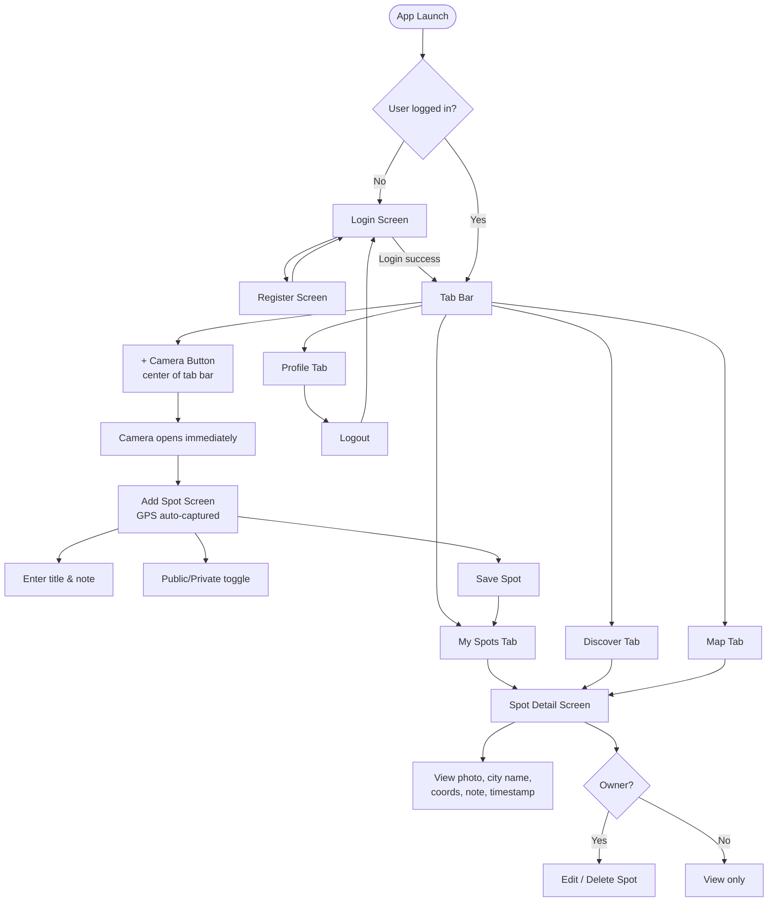

# SpotSave – Planning & Solution Concept
**Module 335 – Kompetenznachweis**
**Author:** Filip Jovic
**Date:** 2026-05-10 (revised 2026-06-22)

---

## Table of Contents
1. [App Idea & Requirements](#1-app-idea--requirements)
2. [Screen Storyboard](#2-screen-storyboard)
3. [Functional Requirements](#3-functional-requirements)
4. [Technical Requirements](#4-technical-requirements)
5. [Test Plan](#5-test-plan)
6. [Solution Concept](#6-solution-concept)

---

## 1. App Idea & Requirements

**SpotSave** is a mobile utility app that lets users save meaningful locations with a photo and a short note. Each spot is geo-tagged using the device's GPS and pinned to an interactive map. Spots can be kept private or optionally shared publicly for others to discover. Think of it as a personal geo-tagged photo journal with an optional public discovery feed.

### Use Cases
- A hiker saves a scenic viewpoint with a photo and note for later reference
- A traveller documents restaurants, shops, or landmarks they want to remember
- A user browses publicly shared spots from other users in the Discover feed
- A user views all their saved spots pinned on a map

---

## 2. Screen Storyboard

The following diagram shows the full screen flow of the app:

---

## 3. Functional Requirements

| # | Feature | Description |
|---|---------|-------------|
| F01 | User Registration | New users can create an account with email & password |
| F02 | User Login | Existing users can log in with email & password |
| F03 | Logout | Users can log out from the Profile screen |
| F04 | Take Photo | Tapping the center camera button opens the camera immediately |
| F05 | Choose from Library | Secondary option on My Spots to pick an existing photo |
| F06 | Auto GPS Capture | GPS coordinates are captured automatically when the Add Spot screen opens |
| F07 | Add Spot | Users can save a spot with photo, GPS, title, note, and visibility setting |
| F08 | My Spots | Users see a list of all their own saved spots with city name and photo |
| F09 | Discover Feed | Users see publicly shared spots from all users |
| F10 | Map View | All user's spots are displayed as pins on an interactive map |
| F11 | Spot Detail | Tapping a spot shows full detail: photo, city name, coordinates, note, timestamp |
| F12 | Edit Spot | Owners can edit title, note, or visibility via a bottom sheet modal |
| F13 | Delete Spot | Owners can delete their own spots |
| F14 | Dark / Light Mode | User can toggle dark or light theme from the Profile screen |
| F15 | Reverse Geocoding | GPS coordinates are resolved to a human-readable city name |

---

## 4. Technical Requirements

| Requirement | Implementation |
|-------------|---------------|
| Sensor 1 – Camera | `expo-camera` / `expo-image-picker` |
| Sensor 2 – GPS | `expo-location` |
| Persistent Storage | Firebase Firestore |
| Authentication | Firebase Authentication (email/password) |
| Framework | React Native with Expo SDK 54 |
| App Type | Hybrid App (cross-platform via Expo) |
| Navigation | `expo-router` v6 (file-based) |
| Image Storage | Cloudinary (unsigned upload preset — free tier, no payment required) |
| Map | `react-native-maps` |
| Theme | Custom `ThemeContext` persisted via `AsyncStorage` |
| Tab Bar | `expo-blur` glass effect + `expo-symbols` SF Symbols icons |
| Deployment | EAS Build → `.apk` |
| Development Testing | Expo Go via local LAN (`npx expo start --go --lan --clear`) |

> **Note on image storage:** Firebase Storage was evaluated but requires the Blaze (pay-as-you-go) plan which requires a credit card. Cloudinary was chosen as a free alternative offering 25 GB storage on the free tier with no payment required. Images are uploaded to Cloudinary and the returned URL is stored as a string field in Firestore alongside the spot metadata. This is a deliberate architectural decision, not a workaround.

---

## 5. Test Plan

### Test Cases

| TC# | Test Case | Precondition | Steps | Expected Result |
|-----|-----------|--------------|-------|-----------------|
| TC01 | Register new user | App open, no account | 1. Open app → Register → Enter email & password → Submit | Account created, user redirected to My Spots |
| TC02 | Login with valid credentials | Account exists | 1. Open app → Login → Enter correct credentials → Submit | User logged in, My Spots screen shown |
| TC03 | Login with invalid credentials | Account exists | 1. Open app → Login → Enter wrong password → Submit | Error message shown, user stays on Login screen |
| TC04 | Add spot via camera | Logged in, real device | 1. Tap center + button → Camera opens → Take photo → Enter title → Save | Spot appears in My Spots with photo and GPS location |
| TC05 | Add spot via photo library | Logged in | 1. Tap "Add from Library" on My Spots → Pick photo → Enter title → Save | Spot appears in My Spots with selected photo |
| TC06 | Auto GPS capture | Logged in | 1. Tap center + button → Add Spot screen opens | GPS coordinates captured automatically, displayed in status bar |
| TC07 | Camera permission denied | Logged in | 1. Tap + button → Deny camera permission | Error shown, user prompted to allow camera in settings |
| TC08 | GPS permission denied | Logged in | 1. Open Add Spot → Deny location permission | Error shown, location shows as unavailable with retry option |
| TC09 | View spot detail | Spots exist | 1. Tap any spot in list | Detail screen shows photo, city name, coordinates, note, timestamp |
| TC10 | Edit own spot | Own spot exists | 1. Open own spot → Tap Edit → Change title/note → Save | Updated content shown in detail view and list |
| TC11 | Delete own spot | Own spot exists | 1. Open own spot → Tap Delete → Confirm | Spot removed from list and Firestore |
| TC12 | Cannot edit other's spot | Public spot from other user visible in Discover | 1. Open other user's spot | No edit or delete option visible |
| TC13 | Logout | Logged in | 1. Go to Profile → Tap Logout | User redirected to Login screen, session cleared |
| TC14 | Firestore persistence | Spot saved | 1. Close and reopen app | Previously saved spots still appear |
| TC15 | Discover feed loads public spots | At least 1 public spot exists | 1. Open Discover tab | Public spots from all users displayed |
| TC16 | Map shows spot pins | At least 1 spot saved | 1. Open Map tab | Spot pins visible on map at correct coordinates |
| TC17 | Dark mode toggle | Logged in | 1. Go to Profile → Toggle dark mode slider | App switches to dark theme, persists after restart |

---

## 6. Solution Concept

### 6a. Framework & App Type

SpotSave is developed as a **Hybrid App** using **React Native with Expo SDK 54**. This allows a single codebase to run on both Android and iOS, while Expo provides pre-built native modules for camera and GPS access without requiring native code configuration.

**Development environment:** Expo Go via local LAN tunnel (`npx expo start --go --lan --clear`) for live device testing. EAS Build for final `.apk` packaging.

**Key components:**
- `expo-camera` / `expo-image-picker` — camera and photo library access
- `expo-location` — GPS coordinates and reverse geocoding
- `firebase/firestore` — cloud database (persistent storage)
- `firebase/auth` — user authentication
- `cloudinary` — image upload and hosting (unsigned upload preset)
- `react-native-maps` — interactive map with spot pins
- `expo-router` — file-based navigation
- `expo-blur` — glass effect tab bar
- `expo-symbols` — SF Symbols icons (iOS native)
- `ThemeContext` + `AsyncStorage` — persistent dark/light mode

### 6b. Sensor, Storage & Auth Usage

**Camera (Sensor 1)**
The center tab bar button opens the camera immediately via `expo-image-picker.launchCameraAsync()`. On the Add Spot screen, the user can also choose an existing photo from their library as a secondary option. The captured image is uploaded to Cloudinary using a base64 encoded request with an unsigned upload preset. The returned secure URL is stored in the Firestore spot document.

**GPS (Sensor 2)**
When the Add Spot screen opens, `expo-location` automatically requests foreground location permission and retrieves the current coordinates (`latitude`, `longitude`) via `getCurrentPositionAsync()` with `Accuracy.Balanced` and an 8-second timeout fallback. Coordinates are stored in the Firestore spot document and displayed on the Map tab via `react-native-maps`. Reverse geocoding via `reverseGeocodeAsync()` converts coordinates to a human-readable city name shown in spot cards and the detail screen.

**Firebase Firestore (Persistent Storage)**
Spots are stored in the following Firestore collections:
- `users/{uid}/spots` — private spots, accessible only to the owner (all spots are written here)
- `spots` — public collection for spots marked as public, readable by all authenticated users

Each document contains: `title`, `note`, `imageUri`, `location` (lat/lng), `isPublic`, `uid`, `createdAt`.

Document IDs are shared between the private and public collections using `doc(collection(...))` + `setDoc` to ensure that edit and delete operations on public spots reference the correct document.

**Firebase Authentication**
Email/password authentication is handled via Firebase Auth with `AsyncStorage` persistence, so users remain logged in across app restarts. Firestore security rules use `request.auth.uid` to enforce that users can only write and delete their own spots.

---

*Document language: English | Deutsche Version: [planning.de.md](planning.de.md)*
