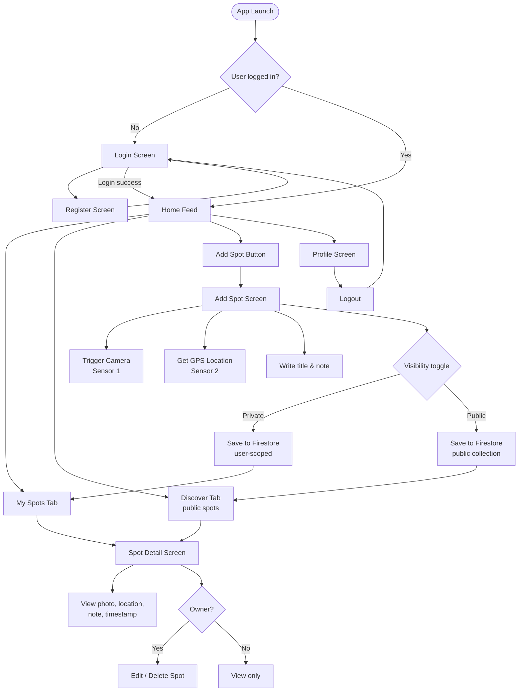

# SpotSave – Planning & Solution Concept
**Module 335 Projekt**  
**Author:** Filip Jovic
**Date:** 2026-05-10

---

## Table of Contents
1. [App Idea & Requirements](#1-app-idea--requirements)
2. [Screen Storyboard](#2-screen-storyboard)
3. [Functional Requirements](#3-functional-requirements)
4. [Technical Requirements](#4-technical-requirements)
5. [Test Plan](#5-test-plan)
6. [Solution Concept](#6-solution-concept)

---

## 1. App Idea & Requirements

**SpotSave** is a mobile utility app that lets users save meaningful locations with a photo and a short note. Each spot can be kept private or shared publicly for others to discover. Think of it as a personal geo-tagged photo journal with an optional public discovery feed.

### Use Cases
- A hiker saves a scenic viewpoint with a photo and note for later reference
- A traveller documents restaurants, shops, or landmarks they want to remember
- A user browses publicly shared spots from other users in their area

---

## 2. Screen Storyboard

The following diagram shows the full screen flow of the app:

---

## 3. Functional Requirements

| # | Feature | Description |
|---|---------|-------------|
| F01 | User Registration | New users can create an account with email & password |
| F02 | User Login | Existing users can log in with email & password |
| F03 | Logout | Users can log out from the Profile screen |
| F04 | Take Photo | Camera opens to capture a photo for a new spot |
| F05 | Get Location | GPS coordinates are automatically captured when adding a spot |
| F06 | Add Spot | Users can save a spot with photo, GPS, title, note, and visibility setting |
| F07 | My Spots | Users see a list of all their own saved spots |
| F08 | Discover Feed | Users see all publicly shared spots from all users |
| F09 | Spot Detail | Tapping a spot shows full detail view (photo, note, location, timestamp) |
| F10 | Edit Spot | Owners can edit the title, note, or visibility of their own spots |
| F11 | Delete Spot | Owners can delete their own spots |
| F12 | Private/Public Toggle | When adding a spot, the user can set its visibility |

---

## 4. Technical Requirements

| Requirement | Implementation |
|-------------|---------------|
| Sensor 1 – Camera | `expo-camera` or `expo-image-picker` |
| Sensor 2 – GPS | `expo-location` |
| Persistent Storage | Firebase Firestore |
| Authentication | Firebase Authentication (email/password) |
| Framework | React Native with Expo |
| App Type | Hybrid App (cross-platform via Expo) |
| Navigation | `expo-router` or `react-navigation` |
| Image Storage | Firebase Storage (for uploaded photos) |
| Deployment | EAS Build → `.apk` |

---

## 5. Test Plan

### Test Cases

| TC# | Test Case | Precondition | Steps | Expected Result |
|-----|-----------|--------------|-------|-----------------|
| TC01 | Register new user | App open, no account | 1. Open app → Register → Enter email & password → Submit | Account created, user redirected to Home |
| TC02 | Login with valid credentials | Account exists | 1. Open app → Login → Enter correct credentials → Submit | User logged in, Home screen shown |
| TC03 | Login with invalid credentials | Account exists | 1. Open app → Login → Enter wrong password → Submit | Error message shown, user stays on Login screen |
| TC04 | Add private spot | Logged in | 1. Tap Add → Take photo → Allow location → Enter title & note → Set Private → Save | Spot appears in My Spots, not in Discover |
| TC05 | Add public spot | Logged in | 1. Tap Add → Take photo → Allow location → Enter title & note → Set Public → Save | Spot appears in both My Spots and Discover |
| TC06 | Camera permission denied | Logged in | 1. Tap Add → Deny camera permission | Error shown, user prompted to allow camera in settings |
| TC07 | GPS permission denied | Logged in | 1. Tap Add → Deny location permission | Error shown, user prompted to allow location in settings |
| TC08 | View spot detail | Spots exist | 1. Tap any spot in list | Detail screen shows photo, note, location, timestamp |
| TC09 | Edit own spot | Own spot exists | 1. Open own spot → Tap Edit → Change note → Save | Updated note shown in detail view |
| TC10 | Delete own spot | Own spot exists | 1. Open own spot → Tap Delete → Confirm | Spot removed from list and Firestore |
| TC11 | Cannot edit other's spot | Public spot from other user visible | 1. Open other user's spot | No edit or delete option visible |
| TC12 | Logout | Logged in | 1. Go to Profile → Tap Logout | User redirected to Login screen, session cleared |
| TC13 | Firestore persistence | Spot saved | 1. Close and reopen app | Previously saved spots still appear |
| TC14 | Discover feed loads public spots | At least 1 public spot exists | 1. Open Discover tab | Public spots from all users displayed |

---

## 6. Solution Concept

### 6a. Framework & App Type

SpotSave is developed as a **Hybrid App** using **React Native with Expo**. This allows a single codebase to run on both Android and iOS, while Expo provides pre-built native modules for camera and GPS access without requiring native code configuration.

**Development environment:** VS Code with Expo Go for live testing on device, EAS Build for final `.apk` packaging.

**Key components:**
- `expo-camera` / `expo-image-picker` — camera access
- `expo-location` — GPS coordinates
- `firebase/firestore` — cloud database
- `firebase/auth` — user authentication
- `firebase/storage` — photo upload & hosting
- `expo-router` — file-based navigation

### 6b. Sensor, Storage & Auth Usage

**Camera (Sensor 1)**  
When a user taps "Add Spot", the app requests camera permission via `expo-image-picker`. The captured image is uploaded to Firebase Storage and the returned URL is stored alongside the spot document in Firestore.

**GPS (Sensor 2)**  
On the Add Spot screen, `expo-location` requests foreground location permission and retrieves the current coordinates (`latitude`, `longitude`). These are stored in the Firestore spot document and can later be used to display the spot on a map.

**Firebase Firestore (Persistent Storage)**  
Spots are stored in two Firestore collections:
- `users/{uid}/spots` — private spots, accessible only to the owner
- `spots` (public collection) — publicly shared spots, readable by all authenticated users

Each document contains: `title`, `note`, `imageUrl`, `location` (lat/lng), `timestamp`, `uid`, `visibility`.

**Firebase Authentication**  
Email/password authentication is handled via Firebase Auth. On login/register, the user receives a session token managed by the Firebase SDK. Firestore security rules use `request.auth.uid` to enforce that users can only write/delete their own spots.

---

*Document language: English | Deutsche Version: [planning.de.md](planning.de.md)*
